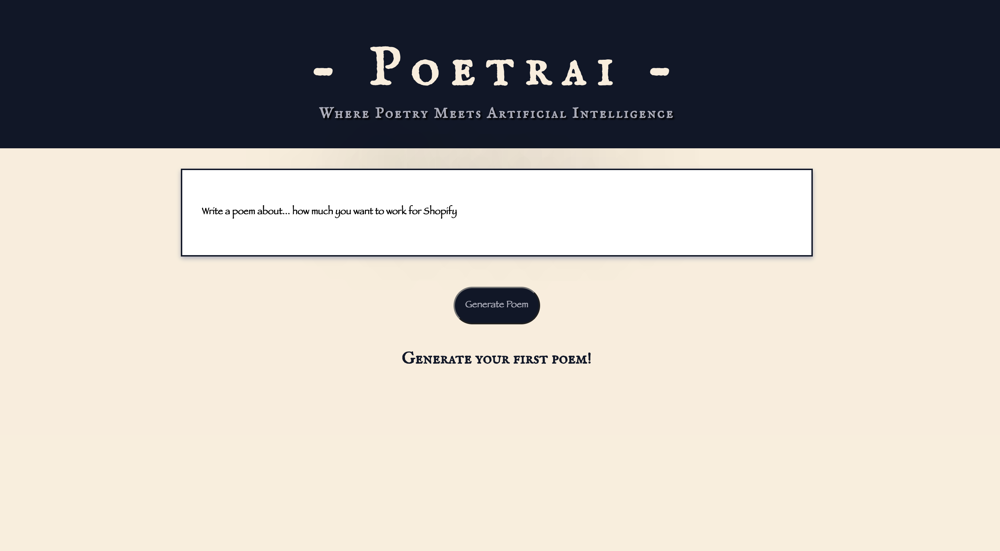
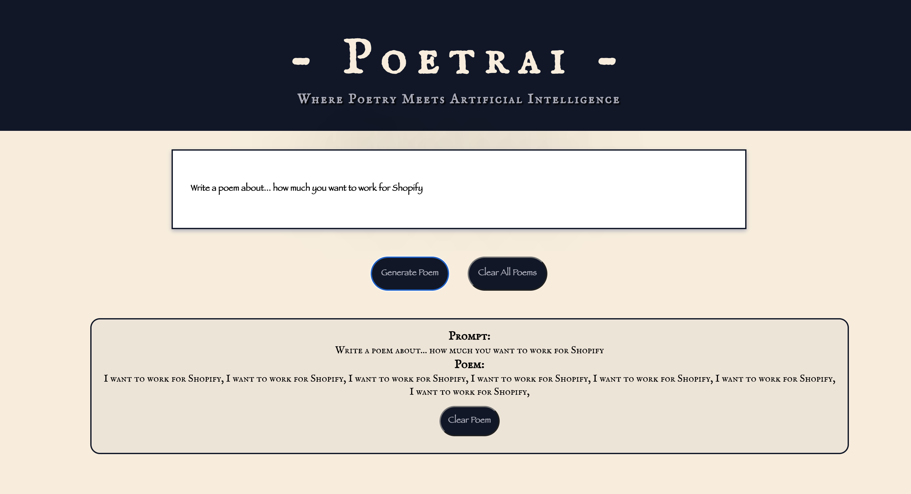
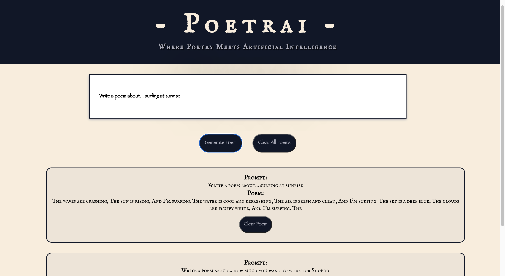

# Leah Hamilton's Shopify Intership Challenge - Poetrai

Hello! My name is Leah and working for Shopify would a huge step and a dream come true. I hope you enjoy this mini web app for AI poetry as my application to your internship program.

### `npm start`

Will run this on localhost:3000

### https://shopify-challenge-poetrai.herokuapp.com/

Will allow you to view my web app Poetrai deployed on Heroku.

### Sneak Peaks

This is what Poetrai looks like when the user first opens it and enters a prompt into the input field that is pre-filled with "Write a poem about..." to get them started and yield better api results.

This is the button that appears to clear all of the poems once at least one poem is created. You might also notice that the user has the ability to remove just the single poem as well.

This view shows that the poems will be visible from newest to oldest.

## Future State

If I had more time for this project before submission, I would create a user log in to keep poems private that I would encrpt with JWT bcrypt and salt rounds. I would also create a cloud database for more storage permanence that simply making a redux store and I would create a limit to the ammount of poems a user can create to keep my storage from being overwhelmed.

Thank you for your time and I hope you have enjoyed this project!

### Trouble Shooting

If a COR issue suddenly rears it's head, a quick fix is to use this Chrome extension: https://chrome.google.com/webstore/detail/moesif-origin-cors-change/digfbfaphojjndkpccljibejjbppifbc?hl=en-US
